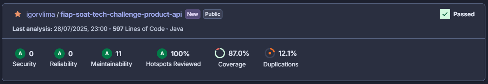

# Tech Challenge - Pós-Tech SOAT - FIAP

Este é o projeto desenvolvido durante a fase IV do curso de pós-graduação em Arquitetura de Software da FIAP - 2025.

Membro do grupo: Igor Veras Lima - RM360611

## Descrição

Este sistema é responsável por gerenciar a criação, consulta, edição e desativação de produtos no ecossistema de um restaurante. Ele permite o cadastro de novos produtos, a busca por produtos existentes e a desativação de produtos quando necessário.

## Arquitetura

O projeto segue a Arquitetura Hexagonal (Ports and Adapters), permitindo maior flexibilidade, testabilidade e facilidade de manutenção. Com isso, a aplicação desacopla regras de negócio de tecnologias específicas como frameworks, banco de dados ou interfaces externas.

## Cobertura de testes da aplicação

